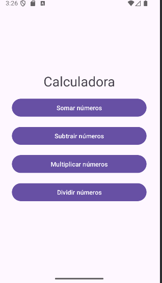
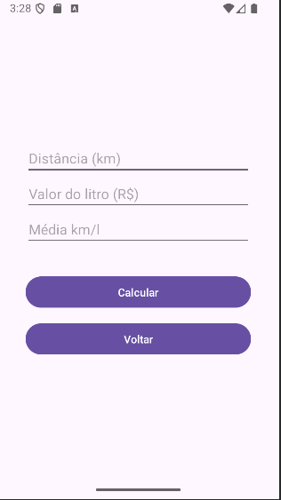
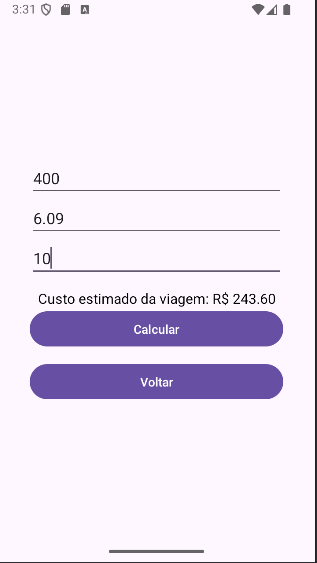

```markdown
# 📱 Calculadora Multifuncional

Projeto Android desenvolvido no Android Studio que implementa uma calculadora com múltiplas funcionalidades e telas intuitivas. Ideal para cálculos rápidos e específicos como consumo, viagem e operações básicas.

---

## 🚀 Como abrir e rodar o projeto

### 1. Pré-requisitos

- Android Studio instalado
- Android SDK configurado
- Java JDK (versão 11 ou superior)

---

### 2. Clonando o repositório

```bash
git clone https://github.com/marconesdb/CalculadoraMultifuncional.git


```

---

### 3. Abrindo no Android Studio

1. Abra o Android Studio.
2. Clique em **"Open"** e selecione a pasta do projeto.
3. Aguarde a sincronização do Gradle.

---

### 4. Rodando o app

- Conecte um dispositivo Android ou use um emulador.
- Clique em **Run ▶️** no Android Studio.
- O app será instalado e executado automaticamente.

---

## 🧭 Navegação entre telas

O app possui várias atividades, cada uma com uma função específica:

### 🏠 Tela Inicial (`HomeActivity`)
- Interface de boas-vindas com botões para acessar os diferentes modos de cálculo.
- 

---

### ➗ Tela de Cálculo Simples (`MainActivity`)
- Realiza operações matemáticas básicas.
- Campos para inserir números e escolher a operação.
- 
- 

---

### 🚗 Tela de Cálculo de Viagem (`ViagemActivity`)
- Calcula o custo de uma viagem com base em distância, consumo e preço do combustível.
- 

---
400
### 📊 Tela de Cálculo de Consumo (`CalculaActivity`)
- Calcula o consumo médio com base em distância percorrida e combustível utilizado.
- 

---

## 📂 Estrutura do projeto

```
CalculadoraMultifuncional/
├── app/
│   └── src/
│       └── main/
│           └── java/com/example/calculadora/
│               ├──  CalculaActivity.java
│               ├──  HomeActivity.java
│               ├──  MainActivity.java
│               └──  ViagemActivity.java
├── build.gradle.kts
├── settings.gradle.kts
├── gradle.properties
└── .gitignore
```

---

## 📌 Observações

- O arquivo `local.properties` não está incluído por conter caminhos locais. O Android Studio recria automaticamente.
- Certifique-se de que o SDK esteja corretamente configurado.

---

## 📧 Contato

Desenvolvido por **Marcone Silva de Brito**  
GitHub: [@marconesdb](https://github.com/marconesdb)

---

```

